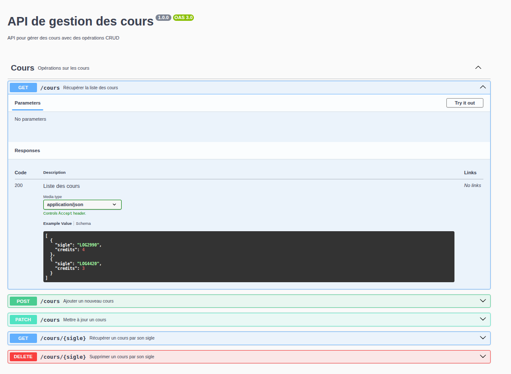

# Méthodes HTTP

Exemple simple de serveur HTTP et requêtes AJAX dans un navigateur avec plusieurs méthodes/verbes différents. Le but de cet exemple est de montrer la sémantique du protocole HTTP au niveau de ses méthodes et de ses codes de retour.

Le projet permet de manipuler une liste de cours (ayant un sigle et un nombre de crédits) en communiquant avec un serveur dynamique.

Le système permet également de générer des nouveaux cours ayant le sigle **INF** et un nombre de crédits aléatoires entre 1 et 5, de supprimer un cours et de modifier le nombre de crédits d'un cours.


# Site Web

Le dossier `client` contient un site web simple qui permet de montrer le fonctionnement de base du protocole HTTP.

Notez que comme le site et le serveur n'ont pas la même origine, une requête `OPTIONS` sera lancée avant l'envoie de certaines requêtes HTTP. La gestion du CORS (Cross-Origin Resource Sharing) est faite par le serveur.

La page web récupère, dès son chargement, la liste des cours en envoyant une requête `GET` au serveur. Ensuite, l'utilisateur peut effectuer plusieurs opérations sur cette liste : ajouter un nouveau cours, supprimer un cours existant ou modifier le nombre de crédits d'un cours.

L'ensemble des requêtes sont envoyées au serveur en utilisant la méthode `fetch` de JavaScript. Cette méthode permet d'envoyer des requêtes HTTP et de récupérer les réponses du serveur. Par défaut, une requête `GET` est envoyée, mais il est possible de spécifier d'autres méthodes HTTP en utilisant l'option `method` dans la configuration de la requête.

Voici un exemple de requête `POST` pour ajouter un nouveau cours :

```javascript
const cours = { sigle: `INF1010`, credits: 12 };
const opts = {
    method: "POST",
    headers: { "Content-Type": "application/json" },
    body: JSON.stringify(cours),
};
const url = `${SERVER_URL}`;
fetch(url, opts).then(...);
```

# Serveur dynamique

L'exemple contient un simple serveur NodeJS avec Express. Toutes les routes sont gérées par un routeur qui répond aux requêtes HTTP ayant le préfixe `/cours`. Il faut donc s'assurer que les requêtes envoyées par le site web ont ce préfixe.

Pour installer les dépendances, il faut lancer la commande `npm ci` dans le répertoire `server`.

Pour lancer le serveur, il faut lancer la commande `npm start` et le serveur sera déployé sur le port `5000` de votre machine.

Le serveur expose plusieurs routes HTTP qui sont décrites dans [router.js](./server/router.js) ainsi que la route `/api` pour la documentation Swagger.

# Méthodes HTTP

Cet exemple illustre le fonctionnement de base de plusieurs méthodes HTTP :
- `GET` : pour récupérer la liste des cours.
- `POST` : pour ajouter un nouveau cours. Le serveur valide que le sigle n'est pas déjà utilisé et retourne une erreur si c'est le cas.
- `DELETE` : pour supprimer un cours existant. Le serveur valide que le cours existe et retourne une erreur si ce n'est pas le cas.
- `PATCH` : pour modifier le nombre de crédits d'un cours existant. Le serveur valide que le cours existe et retourne une erreur si ce n'est pas le cas.

Il n'y a pas d'exemple de la méthode `PUT`, mais la gestion de la création d'un cours peut être implémentée avec cette méthode si on le souhaite. La méthode `PUT` est généralement utilisée pour remplacer complétement une ressource existante, ce qui n'est pas le cas ici.

## Corps des requêtes

En fonction de la méthode HTTP utilisée, le corps des requêtes peut être différent. Les requêtes `GET` et `DELETE` n'ont pas de corps, tandis que les requêtes `POST` et `PATCH` en ont un qui contient les données d'un cours (à ajouter ou à modifier) au format `application/json`. Ce format est défini lors de la création de la requête par le code JS exécuté par le navigateur.

## Paramètres des requêtes

Dans le cas des routes `GET /cours/{sigle}` et `DELETE /cours/{sigle}`, le sigle du cours est passé en paramètre dans l'URL. Le serveur utilise ce paramètre pour identifier le cours à récupérer ou à supprimer. Ici, `{sigle}` est un paramètre de chemin qui est remplacé par la valeur du sigle du cours dans l'URL.

## Codes de retour

Plusieurs des routes du serveur peuvent retourner des codes de retour HTTP différents selon le résultat de la requête. Notez que par défaut, c'est le code `200` qui est retourné si rien n'est spécifié. 

Par exemple, les routes qui manipulent les cours peuvent retourner plusieurs codes différents.
 
La route `POST /cours` retourne les codes suivants :
- `400` (Bad Request) : L'objet envoyé n'est pas complet et ne contient pas les attributs `sigle` ou `credits`.
- `201` (Created): Le cours a été créé avec succès.
- `409` (Conflict): Le sigle du cours est déjà utilisé.

La route `DELETE /cours/{sigle}` retourne les codes suivants :
- `204` (No Content): Le cours a été supprimé avec succès.
- `404` (Not Found): Le cours n'existe pas.

La route `PATCH /cours` retourne les codes suivants :
- `404` (Not Found): Le cours n'existe pas.
- `200` (OK): Le cours a été mis à jour avec succès.

## Corps des réponses

Le corps des réponses varie en fonction de la logique de traitement. Le serveur peut retourner des réponses différentes pour la même route en fonction du résultat de la requête.

Dans le cas des routes `GET /cours` et `GET /cours/{sigle}`, le corps de la réponse contient un objet JSON représentant le cours ou la liste des cours. Pour cette raison, la réponse doit être décodée en JSON dans le code JavaScript du navigateur avant d'être utilisée.

Pour les routes `POST` et `PATCH`, le corps de la réponse est du simple texte.

Dans le cas de `DELETE`, il n'y a pas de corps de réponse, ce qui est logique vu l'utilisation du code `204 No Content`.

# Documentation OpenAPI

Le projet utilise la spécification [OpenAPI](https://www.openapis.org/) pour documenter les routes du serveur. La documentation peut être visualisée dans un navigateur grâce à l'outil Swagger en accédant à l'URL `localhost:5000/api`.

Voici un exemple de la documentation générée :



Cette documentation permet de visualiser les différentes routes du serveur, les paramètres attendus, les réponses possibles et les erreurs. Elle est utile pour comprendre comment interagir avec le serveur et pour tester les différentes routes. Il est possible de tester les routes directement depuis cette documentation en utilisant l'interface fournie et le bouton "Try it out" pour chaque route. Par exemple, la route `GET /cours/{sigle}` permet de récupérer un cours spécifique et n'est pas utilisée par le site web de l'exemple, mais peut être testée directement depuis la documentation.

## Génération de la documentation

La documentation OpenAPI est générée automatiquement à partir des commentaires dans le fichier `router.js` en format `YAML`. Pour mettre à jour la documentation, il suffit de modifier les commentaires et de relancer le serveur. La documentation sera alors mise à jour avec les nouvelles informations.